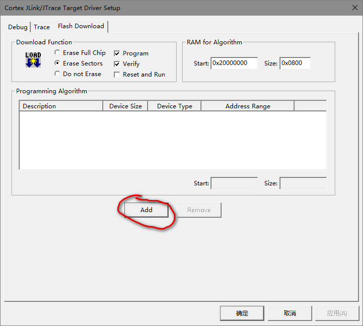
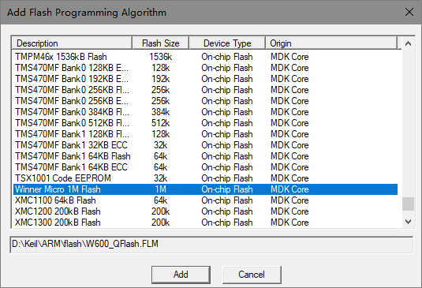

# 使用方法

## 1. 编译 W600_QFlash.FLM 文件

`也可以直接拷贝本目录下的 W600_QFlash.FLM 到 Keil/ARM/Flash 目录下`

1. 拷贝 W600_QFlash 目录到 Keil/ARM/Flash 目录下

2. 双击 W600_QFlash.uvproj 打开项目并编译，默认会生成 W600_QFlash.FLM 并拷贝到上一层目录

## 2. 配置 FLash Download 选项

找到 Jlink Settings -> Flash Download 页面，点击 Add 调出Flash配置选择页面。

找到 Winner Micro 1M Flash 选项并点击下方Add按钮，即可添加更新 Flash 配置。

## 其它

有任何疑问请联系 support@thingsturn.com