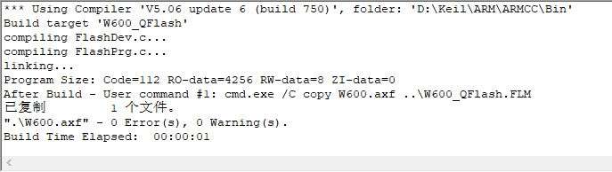

# 使用方法

## 1. 编译 W600_QFlash.FLM 文件

`也可以直接拷贝本目录下的 W600_QFlash.FLM 到 Keil/ARM/Flash 目录下`

1. 拷贝 W600_QFlash 目录到 Keil/ARM/Flash 目录下

2. 双击 W600_QFlash.uvproj 打开项目并编译，默认会生成 W600_QFlash.FLM 并拷贝到上一层目录

## 2. 配置 FLash Download 选项

选择 Project->Options for Target 打开对话框，切换到 Utilities 标签界面，点击 Setting，如下图 Flash Download 标签中配置 RAM 和 Flash 参数必须与前面配置的地址 一致，点击 Add 按钮选择 W60X 芯片的 Flash 驱动。

## 其它

有任何疑问请联系 support@thingsturn.com